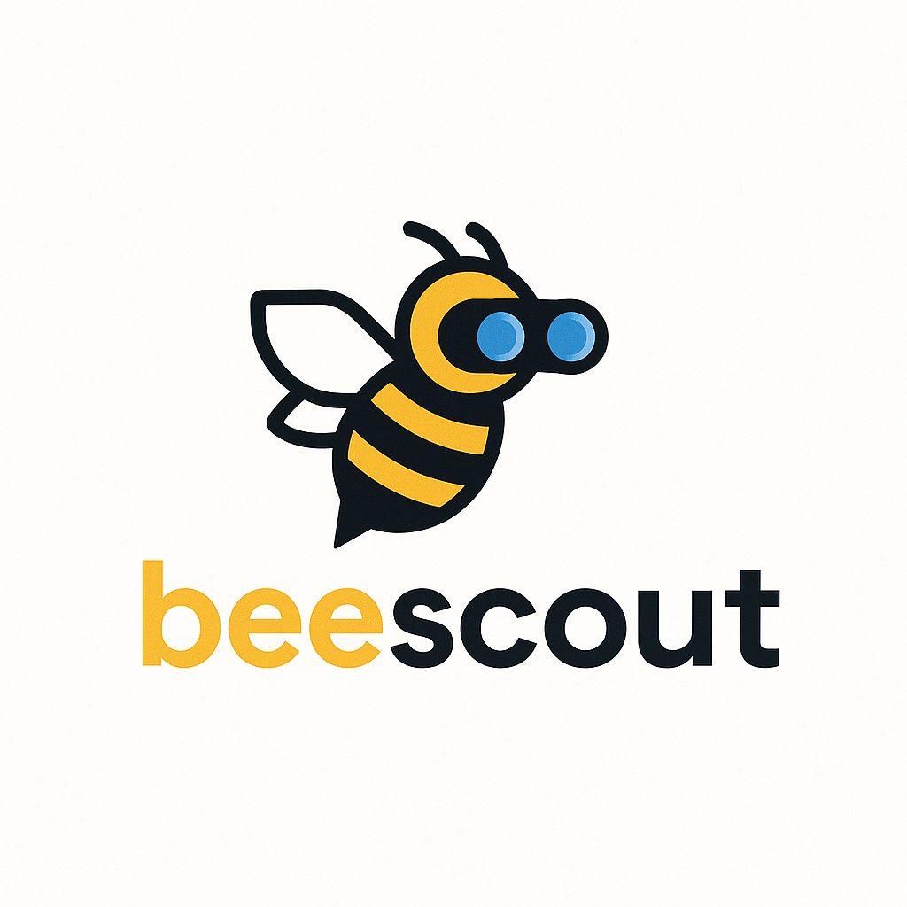
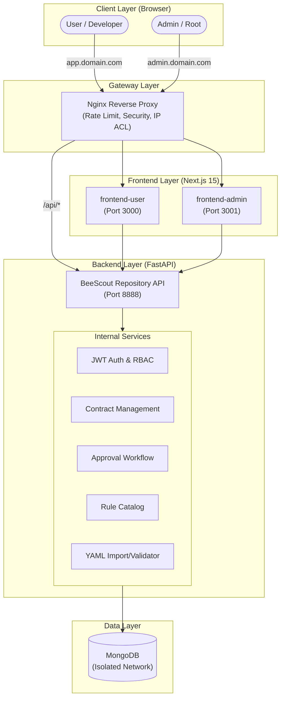
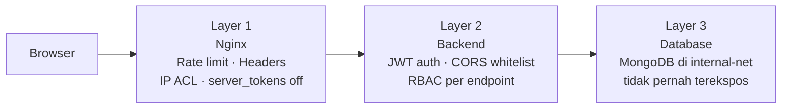
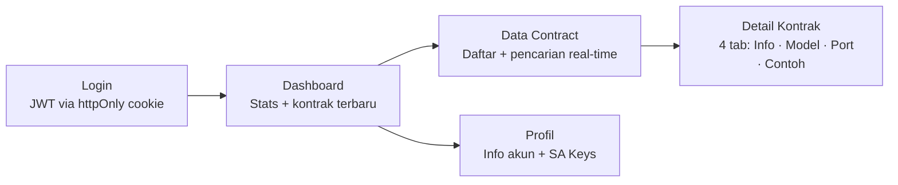
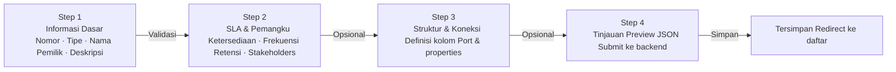
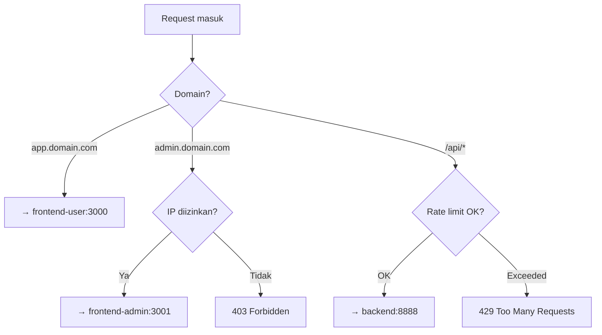

# BeeScout



**Lisensi:** AGPL-3.0 · **Status:** pre-1.0 · **Open source AI-Native** · **Kontribusi disambut**

> **Platform Open Source untuk pengelolaan Data Contract** — terpusat, terstandar, dan kolaboratif. Dibangun dengan filosofi AI-Native: *siapapun bisa berkontribusi, baik yang menulis kode maupun yang merumuskan masalah.*

## Selamat Datang

BeeScout adalah jawaban kami untuk pertanyaan: **"Bagaimana organisasi data bisa dikelola lebih jelas, lebih akuntabel, dan lebih mudah dikolaborasikan — tanpa harus jadi unicorn enterprise tool?"**

Saat ini proyek dalam fase **pre-1.0** — sedang divalidasi via tes UX internal dan perancangan format quality rules. Cocok untuk:

- **Organisasi yang sedang merapikan data governance**-nya
- **Engineer yang bekerja dengan banyak data producer/consumer**
- **Analis bisnis yang butuh tahu "data ini bisa dipercaya tidak?"**
- **Komunitas yang mengeksplorasi pola standar Data Contract** (mengikuti spec [ODCS](https://github.com/bitol-io/open-data-contract-standard))

## Ingin Berkontribusi?

Baik Anda **PM, Business Owner, Developer, atau pengguna AI** — ada jalur yang cocok:

| Profil Anda | Mulai dari |
|---|---|
| **Punya ide tapi bukan coder** (PM/Bisnis) | [Buka issue "Ide Bisnis"](.github/ISSUE_TEMPLATE/business-idea.yml) — bahasa natural, tidak perlu install apa-apa |
| **Developer / engineer** | [Onboarding Kontributor 30 menit](docs/contributor-onboarding.md) → fork → `make dev` |
| **Pakai AI (Claude Code dsb)** | Sama seperti developer, tapi biarkan AI yang menulis kode. Lihat [AI Usage Policy](CONTRIBUTING.md#cara-berkolaborasi-dengan-ai) |
| **Ketemu bug** | [Bug Report template](.github/ISSUE_TEMPLATE/bug-report.yml) |
| **Lapor kerentanan** | Jangan publik — gunakan [SECURITY.md](SECURITY.md) |

> **Baru pertama kali kontribusi OSS?** Mulai di [docs/contributor-onboarding.md](docs/contributor-onboarding.md) — disusun agar Anda bisa selesaikan kontribusi pertama dalam 30 menit.

---

## Executive Summary

BeeScout adalah platform manajemen **Data Contract** — pencatatan metadata, struktur data, SLA, dan aturan kualitas data secara terpusat. Dibangun dengan konsep Data Contract dan dimodifikasi untuk kemudahan penggunaan, BeeScout menjadi landasan interoperabilitas, konsistensi, dan integritas data lintas domain.

Platform ini hadir dengan arsitektur modular penuh: backend API terpusat, dua frontend terpisah (user & admin), reverse proxy berbasis Nginx, dan seluruhnya dapat dijalankan dengan satu perintah Docker Compose.

---

## Filosofi & Metodologi (AI-Native OSS)

BeeScout dikembangkan dengan pendekatan yang unik di dunia Open Source:

1.  **AI-Assisted Development**: Kode sumber proyek ini dibangun dan dipelihara dengan asistensi agentic AI (**Claude Code**) yang dipandu oleh [`CLAUDE.md`](CLAUDE.md) — guardrail proyek.
2.  **Product-First Contribution**: Kami mendesain proyek ini agar inklusif bagi **non-coder**. Ahli domain (Product/UX) bisa berkontribusi dengan mendefinisikan masalah dan instruksi logis, sementara AI membantu mengeksekusinya menjadi kode.
3.  **Persona-Driven Design**: Setiap fitur dirancang untuk melayani persona spesifik (**Pak Bambang, Bu Retno, Mas Dimas, Mbak Indah**) untuk memastikan BeeScout benar-benar menyelesaikan masalah nyata di lapangan. Lihat [docs/personas.md](docs/personas.md).

### Penggunaan AI di proyek ini,

Penggunaan AI **disambut, bukan dilarang**. Kontributor cukup **disclose** level penggunaan AI di setiap PR (Manual / AI-assisted / AI-driven). Lebih lengkap: [CONTRIBUTING.md — Cara Berkolaborasi dengan AI](CONTRIBUTING.md#cara-berkolaborasi-dengan-ai).

Bagi yang ingin paham *bagaimana* AI menulis kode benar di repo ini: baca [CLAUDE.md](CLAUDE.md) — file itu adalah panduan untuk AI agent, sekaligus rujukan konvensi untuk developer manusia.

---


## Arsitektur Sistem



[Lihat detail arsitektur (Mermaid)](docs/architecture.mmd)

### Prinsip Keamanan (Defence in Depth)



---

## Komponen Utama

### Backend — `repository/`

FastAPI REST API dengan MongoDB. Menangani autentikasi JWT, RBAC, dan seluruh operasi Data Contract.

- Endpoint autentikasi: `/login`, `/logout`, `/user/me`
- Endpoint data contract: `/datacontract/lists`, `/datacontract/filter`, `/datacontract/add`, `/datacontract/gencn`
- Endpoint user management: `/user/create`
- Endpoint service account: `/sakey/lists`
- Health check: `/health`
- Rate limiting pada endpoint login via `slowapi`

### Frontend User — `frontend-user/`

Aplikasi Next.js 15 untuk pengguna dengan role **`user`** dan **`developer`**.



| Halaman | Fitur Utama |
|---|---|
| **Login** | Form + Zod validation, toast error, auto-redirect |
| **Dashboard** | Stats cards (kontrak / pemilik / tipe) + 6 kontrak terbaru |
| **Data Contract** | Tabel + pencarian real-time nama/nomor/pemilik/tipe |
| **Detail Kontrak** | 4 tab: Informasi, Struktur Data (kolom+flag), Koneksi, Contoh Data |
| **Profil** | Info akun, badge role/status, tabel Service Account Keys |

### Frontend Admin — `frontend-admin/`

Aplikasi Next.js 15 untuk pengguna dengan role **`admin`** dan **`root`**. Memiliki role guard di layout — akses non-admin langsung ditolak tanpa menyentuh halaman.


| Halaman | Fitur Utama |
|---|---|
| **Login** | Dark theme, "Akses Terbatas", error dari server |
| **Dashboard** | Stats cards + 6 kontrak terbaru + tombol aksi cepat |
| **Data Contract** | Tabel semua kontrak, pencarian, badge tipe berwarna |
| **Detail Kontrak** | 5 tab: Informasi, Struktur Data, Koneksi, Contoh Data, **JSON Raw** |
| **Tambah Kontrak** | Multi-step form 4 langkah dengan indikator progres |
| **Manajemen User** | Form buat user baru, hanya aktif untuk role `root` |
| **Profil Admin** | Info akun, avatar, badge peran/status, SA Keys |

#### Multi-Step Form — Tambah Kontrak



### Nginx — `nginx/`

Reverse proxy yang menangani routing domain, keamanan, dan rate limiting. Konfigurasi domain-agnostic via environment variable — tidak ada yang hardcoded.



---

## Fitur Lanjutan

BeeScout dilengkapi dengan fitur tata kelola data yang canggih untuk mendukung skala enterprise:

### Alur Persetujuan (Approval Workflow)
Pengguna dengan role `user` atau `developer` dapat mengajukan perubahan pada Data Contract. Perubahan tersebut tidak langsung diterapkan, melainkan masuk ke antrean **Pending Approval**.
- Admin/Root akan menerima notifikasi di dashboard.
- Admin/Root dapat meninjau (diff), memberikan komentar/alasan, dan melakukan voting (Approve/Reject).
- Perubahan hanya akan diterapkan secara otomatis jika semua approver memberikan suara setuju.

Panduan lengkap → [**Alur Persetujuan**](docs/approval_workflow.md)

### Katalog Aturan (Rule Catalog)
Pusat pengelolaan aturan kualitas data (Data Quality Rules) yang dapat digunakan kembali di berbagai kontrak.
- Mendukung aturan bawaan (built-in) dan aturan kustom.
- Memastikan konsistensi definisi kualitas data di seluruh organisasi.
- Dapat diakses via API untuk integrasi dengan pipeline CI/CD.

Panduan lengkap → [**Katalog Aturan**](docs/rule_catalog.md)

### Import & Validasi YAML
Mendukung import Data Contract dalam jumlah besar menggunakan format YAML standar ODCS.
- Validasi skema berlapis (YAML syntax & ODCS compliance).
- Deteksi dini kesalahan tipe data atau field wajib sebelum data masuk ke database.

Panduan lengkap → [**Import & Validasi YAML**](docs/yaml_import.md)

---

## Roles & Hak Akses

Empat role menentukan **apa yang bisa dilihat & dilakukan** seseorang di BeeScout. Akses kontrak ditentukan oleh **tim**: kontrak terlihat oleh user yang timnya tercantum sebagai *consumer* (atau *producer*) di kontrak tersebut.

| Role | Frontend | Cakupan akses kontrak | Kemampuan tambahan |
|---|---|---|---|
| `root` | Admin Panel | Semua kontrak | CRUD user (termasuk root), konfigurasi global |
| `admin` | Admin Panel | Semua kontrak | Steward — kelola kontrak & rule catalog lintas tim |
| `developer` | User App | Hanya kontrak yang timnya jadi consumer/producer | Generate Service Account Key untuk integrasi pipeline |
| `user` | User App | Hanya kontrak yang timnya jadi consumer/producer | Read-only dengan kacamata bisnis |

> **Penting**: `developer` dan `user` punya **cakupan akses yang sama** — keduanya hanya melihat kontrak yang timnya tercantum sebagai consumer/producer. Bedanya bukan luas akses, tapi *kacamata*: developer membaca dengan lensa teknis (schema, physical type, SA Key), user membaca dengan lensa bisnis (deskripsi, SLA, makna kolom). Visi cross-team adalah tanggung jawab `admin` (steward), bukan `developer`. Detail di [docs/personas.md](docs/personas.md).

---

## Struktur Repo

```
beescout/
├── repository/           ← Backend (FastAPI + MongoDB)
│   ├── app/
│   │   ├── core/         ← Auth, config, rate limiter
│   │   ├── model/        ← Pydantic models
│   │   └── main.py       ← FastAPI entry point
│   └── infra/            ← Dockerfile, requirements
│
├── frontend-user/        ← Next.js 15 untuk role: user, developer
│   └── src/
│       ├── app/          ← Pages: login, dashboard, contracts, profile
│       ├── components/   ← shadcn/ui + layout
│       └── lib/api/      ← Axios client + API calls
│
├── frontend-admin/       ← Next.js 15 untuk role: admin, root
│   └── src/
│       ├── app/          ← Pages: dashboard, contracts CRUD, users, profile
│       ├── components/   ← shadcn/ui + layout (dark sidebar)
│       └── lib/api/      ← Admin-specific API calls
│
├── nginx/                ← Reverse proxy (env-variable driven)
│   └── templates/        ← nginx.conf template
│
├── docker-compose.yml    ← Production orchestrator
├── docker-compose.dev.yml← Development overrides
├── Makefile              ← Shortcut commands
├── .env.example          ← Template semua environment variables
├── getting-started.md    ← Panduan setup lengkap
└── README.md             ← Dokumen ini
```

---

## Quick Start

```bash
# 1. Clone dan setup env
git clone <url-repo> beescout && cd beescout
cp .env.example .env   # edit domain, password, dan JWT secrets

# 2. Jalankan semua container
make up

# 3. Tambahkan ke /etc/hosts
echo "127.0.0.1 app.localhost admin.localhost" | sudo tee -a /etc/hosts

# 4. Buka browser
#    User app   → http://app.localhost
#    Admin panel → http://admin.localhost
```

Panduan lengkap → [getting-started.md](getting-started.md)
Panduan untuk non-developer (klik-untuk-jalan) → [docs/quick-start-non-tech.md](docs/quick-start-non-tech.md)

---

## Stack Teknologi

| Komponen | Stack |
|---|---|
| Backend | Python · FastAPI · MongoDB · PyJWT · slowapi |
| Frontend | Next.js 15 · TypeScript · Tailwind CSS · shadcn/ui |
| State & Data | TanStack Query · Axios · React Hook Form · Zod |
| Gateway | Nginx (Alpine) |
| Containerisasi | Docker · Docker Compose v2 |

---

## Berkontribusi & Komunitas

BeeScout adalah proyek komunitas. Kontribusi diterima dari siapa saja — manusia maupun AI yang dijalankan kontributor manusia.

| Tujuan | Pergi ke |
|---|---|
| Kontribusi pertama dalam 30 menit | [docs/contributor-onboarding.md](docs/contributor-onboarding.md) |
| Alur lengkap dari issue → release (SDLC) | [docs/sdlc.md](docs/sdlc.md) |
| Etika & jalur kontribusi lengkap | [CONTRIBUTING.md](CONTRIBUTING.md) |
| Kebijakan AI Usage | [CONTRIBUTING.md — Cara Berkolaborasi dengan AI](CONTRIBUTING.md#cara-berkolaborasi-dengan-ai) |
| Tata kelola proyek (siapa decide apa) | [GOVERNANCE.md](GOVERNANCE.md) |
| Roadmap (Now / Next / Later) | [ROADMAP.md](ROADMAP.md) |
| Catatan keputusan arsitektur | [docs/adr/](docs/adr/) |
| Lapor kerentanan keamanan | [SECURITY.md](SECURITY.md) |
| Etika komunitas | [CODE_OF_CONDUCT.md](CODE_OF_CONDUCT.md) |
| Riwayat perubahan | [CHANGELOG.md](CHANGELOG.md) |

---

## Dokumentasi Teknis

| Dokumen | Untuk siapa |
|---|---|
| [Getting Started](getting-started.md) | Setup lokal, troubleshooting infra |
| [Quick Start (non-tech)](docs/quick-start-non-tech.md) | Panduan klik-untuk-jalan untuk pengguna non-teknis |
| [CLAUDE.md](CLAUDE.md) | Konvensi kode, guardrails AI, gotchas teknis |
| [docs/personas.md](docs/personas.md) | 4 persona pengguna BeeScout |
| [docs/glossary.md](docs/glossary.md) | Kamus istilah teknis ↔ bisnis |
| [docs/approval_workflow.md](docs/approval_workflow.md) | Alur persetujuan perubahan kontrak |
| [docs/rule_catalog.md](docs/rule_catalog.md) | Katalog aturan kualitas |
| [docs/yaml_import.md](docs/yaml_import.md) | Import YAML & validasi schema |
| [docs/credentials.md](docs/credentials.md) | Akun default untuk dev |
| [docs/ci_cd.md](docs/ci_cd.md) | Alur pengujian otomatis |

---

## API Reference

Dokumentasi API interaktif tersedia saat aplikasi berjalan di mode development:

- **Swagger UI**: [http://app.localhost/api/docs](http://app.localhost/api/docs)
- **ReDoc**: [http://app.localhost/api/redoc](http://app.localhost/api/redoc)

## References

- https://github.com/bitol-io/open-data-contract-standard
- https://datacontract.com
- https://www.datamesh-architecture.com/

---

## Lisensi

BeeScout dirilis di bawah **GNU Affero General Public License v3.0 (AGPL-3.0)** — lihat [LICENSE](LICENSE).

**Singkatnya**:
- **✅ Boleh**: pakai bebas (self-host, modifikasi, komersial)
- **⚠️ Wajib bagi**: yang mendeploy versi modifikasi sebagai layanan ke pengguna lain (web/API) — source code modifikasi wajib disediakan kepada komunitas.
- **Tidak ada kewajiban tambahan**: untuk modifikasi internal yang tidak dideploy ke pengguna lain

Alasan memilih AGPL ada di [docs/adr/0002-agpl-3-license.md](docs/adr/0002-agpl-3-license.md).

---

## Bergabung??

> *"Data governance terbaik bukan yang paling mahal tools-nya, tapi yang paling banyak orang mau ikut menjaga."*

Apapun peran Anda di organisasi — engineer, analis, PM, manajer data — ada cara untuk berkontribusi di BeeScout. Kalau Anda merasa proyek ini bisa lebih baik, **andalah yang proyek ini butuhkan**.

Mulai dari [docs/contributor-onboarding.md](docs/contributor-onboarding.md). Kami tunggu di [Issues](https://github.com/alamanda-projects/beescout/issues) atau [Discussions](https://github.com/alamanda-projects/beescout/discussions).
