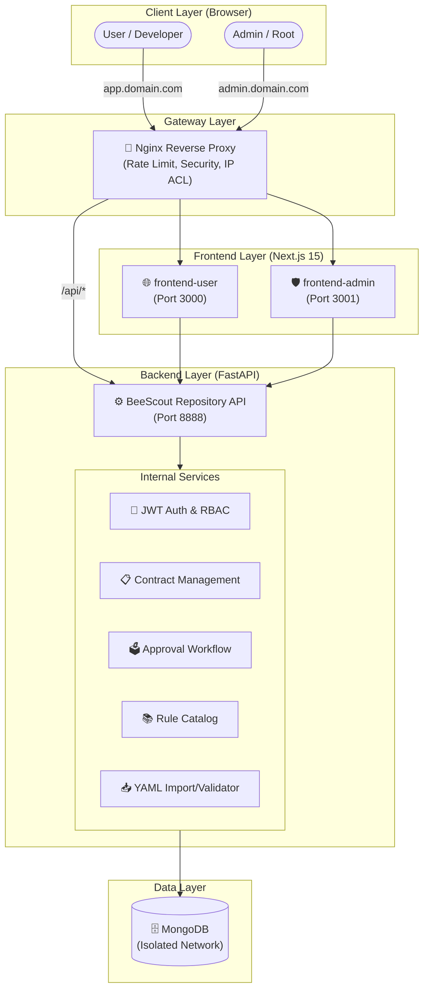
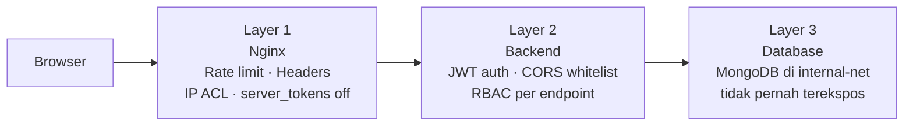
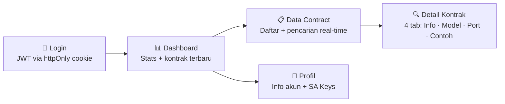
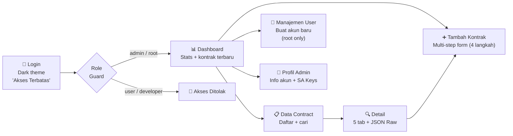
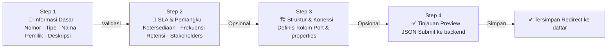

# BeeScout


## Executive Summary

BeeScout adalah platform manajemen **Data Contract** — pencatatan metadata, struktur data, SLA, dan aturan kualitas data secara terpusat. Dibangun dengan konsep Data Contract dan dimodifikasi untuk kemudahan penggunaan, BeeScout menjadi landasan interoperabilitas, konsistensi, dan integritas data lintas domain.

Platform ini kini hadir dengan arsitektur modular penuh: backend API terpusat, dua frontend terpisah (user & admin), reverse proxy berbasis Nginx, dan seluruhnya dapat dijalankan dengan satu perintah Docker Compose.

---

## Arsitektur Sistem



[Lihat detail arsitektur (Mermaid)](docs/architecture.mmd)

### Prinsip Keamanan (Defence in Depth)



---

## Komponen Utama

### 🗄️ Backend — `repository/`

FastAPI REST API dengan MongoDB. Menangani autentikasi JWT, RBAC, dan seluruh operasi Data Contract.

- Endpoint autentikasi: `/login`, `/logout`, `/user/me`
- Endpoint data contract: `/datacontract/lists`, `/datacontract/filter`, `/datacontract/add`, `/datacontract/gencn`
- Endpoint user management: `/user/create`
- Endpoint service account: `/sakey/lists`
- Health check: `/health`
- Rate limiting pada endpoint login via `slowapi`

### 🌐 Frontend User — `frontend-user/`

Aplikasi Next.js 15 untuk pengguna dengan role **`user`** dan **`developer`**.



| Halaman | Fitur Utama |
|---|---|
| **Login** | Form + Zod validation, toast error, auto-redirect |
| **Dashboard** | Stats cards (kontrak / pemilik / tipe) + 6 kontrak terbaru |
| **Data Contract** | Tabel + pencarian real-time nama/nomor/pemilik/tipe |
| **Detail Kontrak** | 4 tab: Informasi, Struktur Data (kolom+flag), Koneksi, Contoh Data |
| **Profil** | Info akun, badge role/status, tabel Service Account Keys |

### 🛡️ Frontend Admin — `frontend-admin/`

Aplikasi Next.js 15 untuk pengguna dengan role **`admin`** dan **`root`**. Memiliki role guard di layout — akses non-admin langsung ditolak tanpa menyentuh halaman.



| Halaman | Fitur Utama |
|---|---|
| **Login** | Dark theme, "Akses Terbatas", error dari server |
| **Dashboard** | Stats cards + 6 kontrak terbaru + tombol aksi cepat |
| **Data Contract** | Tabel semua kontrak, pencarian, badge tipe berwarna |
| **Detail Kontrak** | 5 tab: Informasi, Struktur Data, Koneksi, Contoh Data, **JSON Raw** |
| **Tambah Kontrak** | Multi-step form 4 langkah dengan indikator progres |
| **Manajemen User** | Form buat user baru, hanya aktif untuk role `root` |
| **Profil Admin** | Info akun, avatar, badge peran/status, SA Keys |

#### Multi-Step Form — Tambah Kontrak



### 🔀 Nginx — `nginx/`

Reverse proxy yang menangani routing domain, keamanan, dan rate limiting. Konfigurasi domain-agnostic via environment variable — tidak ada yang hardcoded.

```mermaid
graph TD
    Req[Request masuk] --> DomainCheck{Domain?}
    DomainCheck -->|"app.domain.com"| UserFE["→ frontend-user:3000"]
    DomainCheck -->|"admin.domain.com"| IPCheck{IP diizinkan?}
    IPCheck -->|"Ya"| AdminFE["→ frontend-admin:3001"]
    IPCheck -->|"Tidak"| Block["403 Forbidden"]
    DomainCheck -->|"/api/*"| RateCheck{Rate limit OK?}
    RateCheck -->|"OK"| BackendFE["→ backend:8888"]
    RateCheck -->|"Exceeded"| Throttle["429 Too Many Requests"]

---

## Fitur Lanjutan

BeeScout dilengkapi dengan fitur tata kelola data yang canggih untuk mendukung skala enterprise:

### 🗳️ Alur Persetujuan (Approval Workflow)
Pengguna dengan role `user` atau `developer` dapat mengajukan perubahan pada Data Contract. Perubahan tersebut tidak langsung diterapkan, melainkan masuk ke antrean **Pending Approval**.
- Admin/Root akan menerima notifikasi di dashboard.
- Admin/Root dapat meninjau (diff), memberikan komentar/alasan, dan melakukan voting (Approve/Reject).
- Perubahan hanya akan diterapkan secara otomatis jika semua approver memberikan suara setuju.

Panduan lengkap → [**Alur Persetujuan**](docs/approval_workflow.md)

### 📚 Katalog Aturan (Rule Catalog)
Pusat pengelolaan aturan kualitas data (Data Quality Rules) yang dapat digunakan kembali di berbagai kontrak.
- Mendukung aturan bawaan (built-in) dan aturan kustom.
- Memastikan konsistensi definisi kualitas data di seluruh organisasi.
- Dapat diakses via API untuk integrasi dengan pipeline CI/CD.

Panduan lengkap → [**Katalog Aturan**](docs/rule_catalog.md)

### 📥 Import & Validasi YAML
Mendukung import Data Contract dalam jumlah besar menggunakan format YAML standar ODCS.
- Validasi skema berlapis (YAML syntax & ODCS compliance).
- Deteksi dini kesalahan tipe data atau field wajib sebelum data masuk ke database.

Panduan lengkap → [**Import & Validasi YAML**](docs/yaml_import.md)
```

---

## Roles & Hak Akses

| Role | Akses Frontend | Kemampuan |
|---|---|---|
| `root` | Admin Panel | Full access — buat user, kelola semua kontrak, semua domain |
| `admin` | Admin Panel | Kelola kontrak, lihat semua domain, tidak bisa buat user |
| `developer` | User App | Baca kontrak lintas domain, generate service account key |
| `user` | User App | Baca kontrak sesuai `data_domain` yang ditentukan |

---

## Struktur Repo

```
beescout/
├── repository/           ← Backend (FastAPI + MongoDB)
│   ├── app/
│   │   ├── core/         ← Auth, config, rate limiter
│   │   ├── model/        ← Pydantic models
│   │   └── main.py       ← FastAPI entry point
│   └── infra/            ← Dockerfile, requirements
│
├── frontend-user/        ← Next.js 15 untuk role: user, developer
│   └── src/
│       ├── app/          ← Pages: login, dashboard, contracts, profile
│       ├── components/   ← shadcn/ui + layout
│       └── lib/api/      ← Axios client + API calls
│
├── frontend-admin/       ← Next.js 15 untuk role: admin, root
│   └── src/
│       ├── app/          ← Pages: dashboard, contracts CRUD, users, profile
│       ├── components/   ← shadcn/ui + layout (dark sidebar)
│       └── lib/api/      ← Admin-specific API calls
│
├── nginx/                ← Reverse proxy (env-variable driven)
│   └── templates/        ← nginx.conf template
│
├── docker-compose.yml    ← Production orchestrator
├── docker-compose.dev.yml← Development overrides
├── Makefile              ← Shortcut commands
├── .env.example          ← Template semua environment variables
├── getting-started.md    ← Panduan setup lengkap
└── README.md             ← Dokumen ini
```

---

## Quick Start

```bash
# 1. Clone dan setup env
git clone <url-repo> beescout && cd beescout
cp .env.example .env   # edit domain, password, dan JWT secrets

# 2. Jalankan semua container
make up

# 3. Tambahkan ke /etc/hosts
echo "127.0.0.1 app.localhost admin.localhost" | sudo tee -a /etc/hosts

# 4. Buka browser
#    User app   → http://app.localhost
#    Admin panel → http://admin.localhost
```

Panduan lengkap → [getting-started.md](getting-started.md)

---

## Stack Teknologi

| Komponen | Stack |
|---|---|
| Backend | Python · FastAPI · MongoDB · PyJWT · slowapi |
| Frontend | Next.js 15 · TypeScript · Tailwind CSS · shadcn/ui |
| State & Data | TanStack Query · Axios · React Hook Form · Zod |
| Gateway | Nginx (Alpine) |
| Containerisasi | Docker · Docker Compose v2 |

---

## How to Contribute

Informasi lebih lanjut untuk bergabung dan berkolaborasi dalam project ini bisa melihat halaman [Contributing](CONTRIBUTING.md).

## Changelog

Informasi lebih lanjut mengenai segala perubahan dalam project ini bisa dilihat pada halaman [Changelog](CHANGELOG.md).

---

## Sumber Daya Pengembang

- [**Getting Started Guide**](getting-started.md) — Panduan instalasi dan konfigurasi mendalam.
- [**Claude Guardrails (CLAUDE.md)**](CLAUDE.md) — Panduan teknis, konvensi kode, dan troubleshooting.
- [**Contributing Guide**](CONTRIBUTING.md) — Cara berkontribusi dan etika kolaborasi.
- [**CI/CD & Testing**](docs/ci_cd.md) — Alur kerja pengujian otomatis.
- [**Kredensial Default**](docs/credentials.md) — Daftar akun untuk pengembangan.

---

## API Reference

Dokumentasi API interaktif tersedia saat aplikasi berjalan di mode development:

- **Swagger UI**: [http://app.localhost/api/docs](http://app.localhost/api/docs)
- **ReDoc**: [http://app.localhost/api/redoc](http://app.localhost/api/redoc)

## References

- https://github.com/bitol-io/open-data-contract-standard
- https://datacontract.com
- https://www.datamesh-architecture.com/
