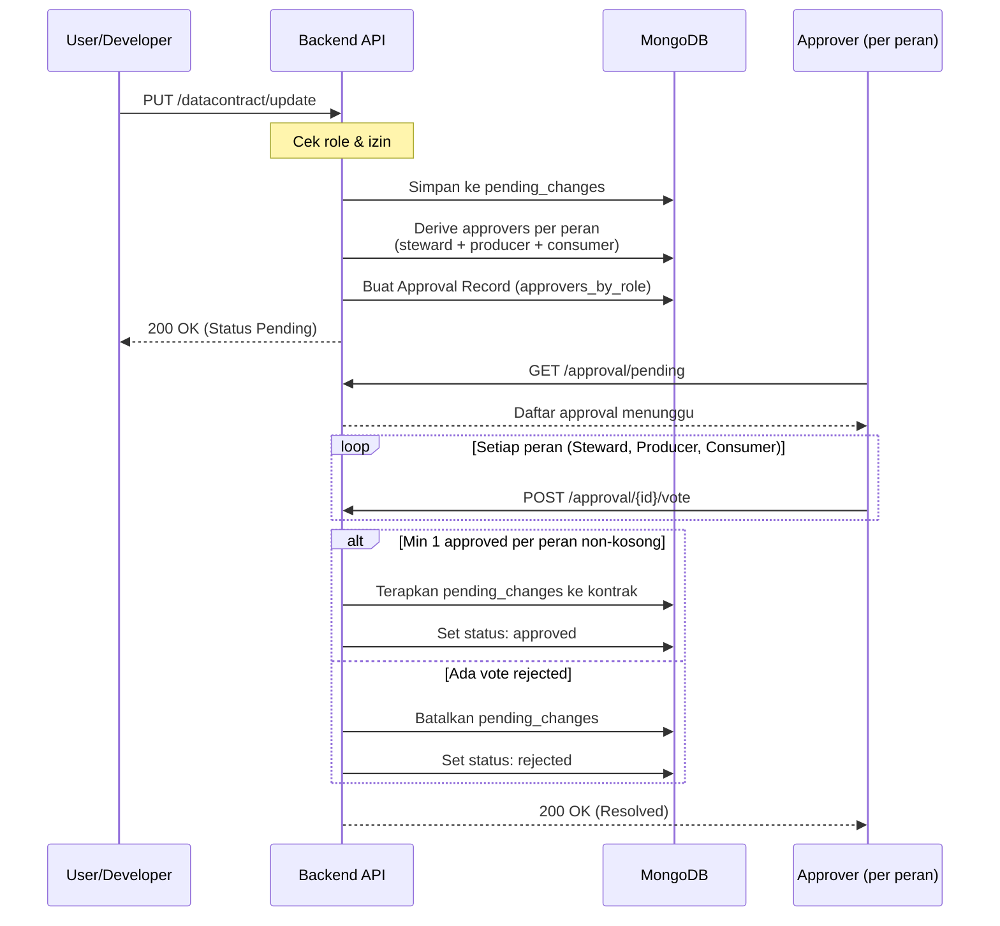

# Alur Persetujuan (Approval Workflow)

BeeScout menerapkan mekanisme tata kelola data di mana perubahan pada kontrak data oleh pengguna non-admin (`user` atau `developer`) harus melalui proses peninjauan dan persetujuan.

Sejak [ADR-0004](adr/0004-approval-workflow-multi-role.md), konsensus dihitung **per peran** (Steward + Producer + Consumer), bukan per-individu.

## 🔄 Alur Kerja



## 🛠️ Endpoints

| Method | Endpoint | Deskripsi |
|---|---|---|
| `PUT` | `/datacontract/update` | Mengajukan perubahan (otomatis masuk antrean jika non-admin) |
| `GET` | `/approval/pending` | Approval yang perlu di-vote oleh user saat ini |
| `GET` | `/approval/mine` | Approval yang diajukan oleh user saat ini |
| `POST` | `/approval/{id}/vote` | Memberikan suara (`approved` / `rejected`) |

## 👥 Aturan Voting (ADR-0004)

### Sumber data approver per peran

| Peran | Diambil dari |
|---|---|
| **Steward** | Semua user aktif dengan `group_access` `root` atau `admin` |
| **Producer** | `metadata.stakeholders[*]` dengan `role == "producer"` dan `username` terisi |
| **Consumer** | `metadata.stakeholders[*]` dengan `role == "consumer"` dan `username` terisi |

Hanya stakeholder yang **username-nya terisi** *dan* **user-nya aktif** di koleksi `dgrusr` yang dihitung. Stakeholder tanpa username tetap valid sebagai informasi, tapi tidak diberi hak vote.

### Konsensus (quorum)

- **Minimum 1 suara `approved` per peran** yang punya approver.
- Peran yang kosong (mis. kontrak tanpa stakeholder Consumer ber-username) → dianggap **auto-pass** dan dicatat di field `fallback_roles` untuk audit trail.
- Satu vote `rejected` dari peran manapun langsung membatalkan pengajuan (veto tetap berlaku).

Contoh approval doc setelah perubahan:

```json
{
  "approval_id": "abc123",
  "approvers": ["bu_retno", "pak_dimas", "mbak_indah"],
  "approvers_by_role": {
    "steward":  ["bu_retno"],
    "producer": ["pak_dimas"],
    "consumer": ["mbak_indah"]
  },
  "fallback_roles": [],
  "votes": [
    {"username": "bu_retno",  "vote": "approved"},
    {"username": "pak_dimas", "vote": "approved"},
    {"username": "mbak_indah","vote": "approved"}
  ],
  "status": "approved"
}
```

### Backward compatibility

Approval `pending` yang dibuat **sebelum** ADR-0004 deploy tidak punya field `approvers_by_role`. Vote endpoint mendeteksi ini dan jatuh kembali ke logika lama (konsensus = semua approver setuju). Tidak perlu menunggu admin migrasi untuk dapat menyelesaikan approval in-flight.

Admin yang ingin men-derive `approvers_by_role` untuk approval lama bisa menjalankan:

```bash
docker compose run --rm backend python -m scripts.migrate_approval_roles            # dry-run
docker compose run --rm backend python -m scripts.migrate_approval_roles --apply    # eksekusi
```

Script idempoten — aman dijalankan ulang.

## 🚧 Risiko & mitigasi

| Risiko | Mitigasi |
|---|---|
| Producer/Consumer tidak responsif → approval nyangkut | UI menampilkan progres per peran (kandidat #?? — frontend PR berikutnya). Auto-timeout = kandidat issue terpisah. |
| Kontrak lama belum punya `stakeholders[*].username` | Auto-pass per peran (lihat `fallback_roles`); UI bisa mendorong pelengkapan. |
| Stakeholder ditambah tapi user-nya kemudian dinonaktifkan | Derivation sudah menyaring `is_active: true`. Approval baru otomatis bypass user inaktif. |
