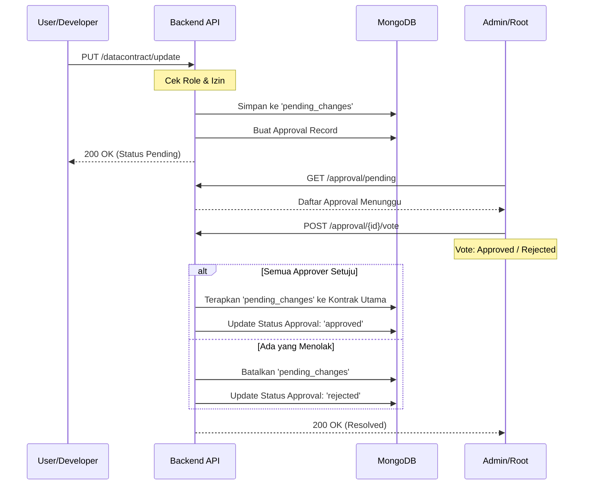

# Alur Persetujuan (Approval Workflow)

BeeScout menerapkan mekanisme tata kelola data di mana perubahan pada kontrak data oleh pengguna non-admin (`user` atau `developer`) harus melalui proses peninjauan dan persetujuan.

## 🔄 Alur Kerja

## 🛠️ Endpoints Terkait

| Method | Endpoint | Deskripsi |
|---|---|---|
| `PUT` | `/datacontract/update` | Mengajukan perubahan (otomatis masuk antrean jika non-admin) |
| `GET` | `/approval/pending` | Melihat daftar approval yang perlu di-vote oleh user saat ini |
| `GET` | `/approval/mine` | Melihat daftar approval yang diajukan oleh user saat ini |
| `POST` | `/approval/{id}/vote` | Memberikan suara (approve/reject) pada pengajuan |

## 👥 Aturan Voting

1. **Approver**: Secara otomatis mencakup semua Admin/Root yang aktif, serta pengelola kontrak yang bersangkutan.
2. **Konsensus**: Perubahan hanya akan diterapkan jika **seluruh** approver yang ditugaskan memberikan suara `approved`.
3. **Veto**: Satu suara `rejected` akan langsung membatalkan seluruh pengajuan.
